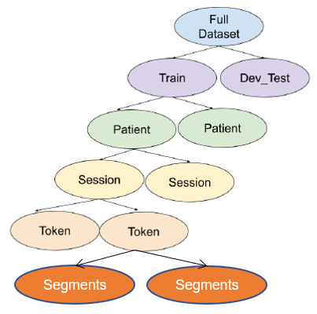

# Overview

This repository provides code for the EEGNet + Transformer model for EEG seizure detection proposed in the paper: Automated Seizure Detection using Transformer Models on Multi-Channel EEGs

Authors: Yuanda Zhu, Prof. May D. Wang

Affiliation: Georgia Institute of Technology, Atlanta, GA, USA

🔗 [Connect with Yuanda on LinkedIn](https://www.linkedin.com/in/yuanda-zhu/)

🔗 [Check Yuanda's Google Scholar](https://scholar.google.com/citations?user=uYPzS5MAAAAJ&hl=en)

🔗 [Check Professor Wang's Google Scholar](https://scholar.google.com/citations?user=iCx27kUAAAAJ&hl=en)

Feel free to know more about us and our lab:

[](https://miblab.bme.gatech.edu/)

# Contents of This Repo

1. [Development Environment](#development-environment)
2. [Dataset Description](#dataset-description)
3. [Preprocessing Steps](#preprocessing-steps)
4. [Our Proposed Approach](#our-proposed-approach)
5. [Implementation of Models from Literature](#implementation-of-models-from-literature)
6. [References](#references)

# Development Environment

* Navigate to this folder, create the conda environment for EEG seizure detection using the environment.yml file. Make sure GPU is available and CUDA is installed. 

```
conda env create -f environment.yml
```

* Activate the environment

```
conda activate myEEGs
```

# Dataset Description
Temple University Hospital (TUH) EEG Corpus includes a large number of EEGs data. Detailed information and instructions are summarized in this page: https://isip.piconepress.com/projects/tuh_eeg/html/downloads.shtml

## Request access to TUH EEG Corpus. 
According to TUH EEG website, 

"To request access to the TUH EEG Corpus, please fill out [this form][1] and email a signed copy to help@nedcdata.org. Please include "Download The TUH EEG Corpus" in the subject line."

[1]: https://isip.piconepress.com/projects/tuh_eeg/html/data_sharing.pdf

## Access the The TUH EEG Seizure Corpus (TUSZ) dataset
Once you receive the username and password from the dataset owner, please find the TUSZ dataset here: https://isip.piconepress.com/projects/tuh_eeg/downloads/tuh_eeg_seizure/

If you want to download the latest version of the dataset, you can use "Rsync" command. The latest version is v2.0.0 as of 08/16/2023.

~~~~
rsync -auxvL --delete nedc-eeg@www.isip.piconepress.com:data/eeg/tuh_eeg_seizure/v2.0.0/ .
~~~~

Notes from the webpage:

1. "Note that the "." at the end of this command is very important since it denotes the destination directory. Without a destination directory specification, the command will not transfer any data."

2. "The username and password are the same as what you use to access the web-based version of these resources."

3. "Note that the "-L" option in rsync instructs it to follow links. All of our corpora are linked back to TUEG. It is best to always use the "-L" option."

## Dataset used in this project is v1.5.2
The TUSZ dataset used in this project is an older version (v1.5.2). It has a hierarchical structure as shown in the figure below.



Please note that the latest version has a slightly different hierarchical structure than the old one. Please refer to 

# Preprocessing Steps
Please use these two Juypter Notebooks to preprocess the TUSZ data (v1.5.2):
- **new_preprocess_TUSZ_data_preparation.ipynb** This file fulfills all steps described in the data preprocessing steps. This file is only valid for v1.5.2.
    - Please note that this file **new_preprocess_TUSZ_data_preparation.ipynb** utilizes functions implemented in **data_reader_new.py**. It is only applicable to v1.5.2. 
    - If you wish to try our code with the latest version (v2.0.0), please use this jupyter notebook **new_preprocess_TUSZ_2023_data_preparation.ipynb**, which imports functions from file **data_reader_2023.py**. Please carefully debug if there is any error.
- **copy_balanced_samples.ipynb** This file is only to undersample the major class samples so that we will have the equal number of samples across different classes.


# Our Proposed Approach

Our proposed approach is implemented in file: **my_own_train_with_EEGNet_Transformer_ver2_hyperparameter_tuning.py**

## Overall diagram
Here is an overall diagram of our proposed approach.


## Model architecture and output shape
Model architecture and data/ output shape is shown here:

| **Module**     | **Layer**                  | **\# Filters** | **Kernel Size** | **Output Shape**           |
| :------------- | :------------------------- | :------------: | :-------------: | :------------------------: |
| Input EEG      |                            |                |                 | (batch size, 22, 1000)     |
| CNN            | Temporal Conv2D            | 64             | (1, K\_C1)      | (batch size, 64, 22, 1000) |
|                | Batch Norm                 |                |                 |                            |
|                | DepthWise Conv2D           | 256            | (C, 1)          | (batch size, 256, 1, 1000) |
|                | Batch Norm                 |                |                 |                            |
|                | ELU                        |                |                 |                            |
|                | Average Pooling            |                | (1, 5)          | (batch size, 256, 1, 200)  |
|                | Separable Conv2D           |                | (1, 16)         |                            |
|                | Batch Norm                 |                |                 |                            |
|                | ELU                        |                |                 |                            |
|                | Average Pooling            |                | (1, 5)          | (batch size, 256, 1, 40)   |
| Transformer    | Insert a Learnable Vector  |                |                 | (257, batch size, 40)      |
|                | Positional Encoding        |                |                 |                            |
|                | Transformer Encoder Layers |                |                 |                            |
| Classification | Linear Layer               |                |                 | (batch size, 2)            |

## Binary seizure detection results

|              | Precision | Recall | F1-Score | Support |
|--------------|:------------------:|:---------------:|:-----------------:|-----------------:|
| No Seizure   |        0.864       |      0.805      |       0.833       |          101,368 |
| Seizure      |        0.584       |      0.683      |       0.630       |           40,650 |
| Macro Avg    |        0.724       |      0.744      |       0.731       |          142,018 |
| Weighted Avg |        0.783       |      0.770      |       0.775       |          142,018 |

# Implementation of Models from Literature

Additionally, we implemented/ replicated codes from literature and follow the same training/ testing pipeline on our processed dataset.

These papers include:
- EEGNet, [paper][2]
  - Implemented in file **someone_else_train_with_EEGNet_only.py**
- EEG-TCNet, [paper][3], [original code][4]
  - Implemented in file **someone_else_train_with_TCNet.py**
- EEG-ACTNet, [paper][5], [original code][6]
  - Implemented in file **someone_else_train_with_ACTNet.py**
- Sun et al. 2022 JBHI, [paper][7]
  - Implemented in file **someone_else_train_with_CNN_and_Transformers.py**

[2]: https://iopscience.iop.org/article/10.1088/1741-2552/aace8c
[3]: https://ieeexplore.ieee.org/abstract/document/9283028
[4]: https://github.com/iis-eth-zurich/eeg-tcnet
[5]: https://ieeexplore.ieee.org/document/9852687
[6]: https://github.com/Altaheri/EEG-ATCNet
[7]: https://ieeexplore.ieee.org/abstract/document/9858598

## Results comparison

| **Approach/ Paper** | **Key Model Components**          | **Macro F1** | **Macro Precision** | **Macro Recall** |
|---------------------|-----------------------------------|:------------:|:-------------------:|:----------------:|
| EEGNet, 2018        | EEGNet                            |     0.700    |        0.706        |       0.696      |
| EEG-TCNet, 2020     | EEGNet + TCN                      |     0.689    |        0.695        |       0.738      |
| ATCNet, 2022        | EEGNet + MSA + TCN                |     0.707    |        0.706        |       0.707      |
| Sun et al., 2022    | Shallow CNN + Transformer Encoder |     0.710    |        0.702        |       0.732      |
| **Ours**            | **EEGNet + Transformer Encoder**  |   **0.731**  |      **0.724**      |     **0.744**    |

# References

If you find this work useful in your research, please use the following BibTeX entry for citation:

    TBD